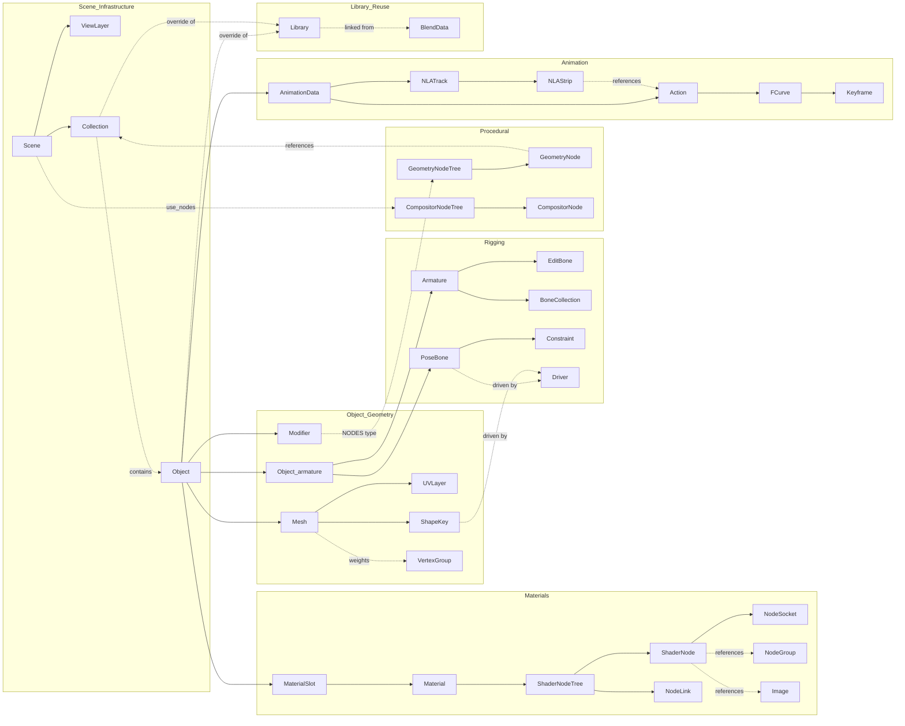

# TYPE-GRAPH.md

The entity types Blender exposes, who produces them, who consumes them, and how IDs chain between tool calls.

Blender is **name-keyed** (see [DECISIONS.md ADR-005](../DECISIONS.md)) — every datablock has a `.name` that is unique within its `bpy.data` collection. Tool outputs return `refs.<entityName>` strings (or string arrays) that the next tool consumes as inputs.

This file is the **dependency map** for tool authors: when you add a new tool, find its inputs in this graph (who produces them) and its outputs (who consumes them). That defines `relatedTools.upstream[]` and `relatedTools.downstream[]` per the [MCP tool contract](../../rules/mcp-tools.md).

---

## 1. The entity catalog

The 25 entity types the agent touches, grouped by domain.

### 1.1 Core data (scene infrastructure)

| Type | Blender API | Ref name | Owned by | Cardinality |
|---|---|---|---|---|
| `Scene` | `bpy.data.scenes[name]` | `sceneName` | `bpy.data` | many per `.blend`; one active at a time |
| `Collection` | `bpy.data.collections[name]` | `collectionName` | `bpy.data` | tree under `scene.collection` |
| `ViewLayer` | `scene.view_layers[name]` | `viewLayerName` | `Scene` | many per scene |
| `Library` | `bpy.data.libraries[name]` | `libraryName` | `bpy.data` | one per linked `.blend` |
| `BlendData` | `bpy.data` | — | global | the root |

### 1.2 Objects + geometry

| Type | Blender API | Ref name | Owned by | Cardinality |
|---|---|---|---|---|
| `Object` | `bpy.data.objects[name]` | `objectName` | `bpy.data` | many; `obj.type` ∈ {MESH, ARMATURE, EMPTY, CAMERA, LIGHT, …} |
| `Mesh` | `bpy.data.meshes[name]` | `meshName` (rarely chained; via `objectName`) | `bpy.data` | many; data shared between objects via linked-duplicate |
| `Modifier` | `obj.modifiers[name]` | `modifierName` (scoped by `objectName`) | `Object` | ordered list per object |
| `VertexGroup` | `mesh_obj.vertex_groups[name]` | `vertexGroupName` (scoped by `objectName`) | `Object` (mesh) | many per object |
| `ShapeKey` | `mesh.shape_keys.key_blocks[name]` | `shapeKeyName` (scoped by `objectName`) | `Mesh` | many; basis + relative deltas |
| `UVLayer` | `mesh.uv_layers[name]` | `uvLayerName` (scoped by `objectName`) | `Mesh` | up to 8 per mesh |

### 1.3 Armature + rigging

| Type | Blender API | Ref name | Owned by | Cardinality |
|---|---|---|---|---|
| `Armature` | `bpy.data.armatures[name]` | `armatureName` (and an `Object` with `obj.data = armature`) | `bpy.data` | many |
| `EditBone` | `armature.edit_bones[name]` (Edit Mode only) | `boneName` (transient) | `Armature` | many; only valid in Edit Mode |
| `Bone` | `armature.bones[name]` (read-only outside Edit Mode) | `boneName` | `Armature` | mirror of EditBones after exit |
| `PoseBone` | `arm_obj.pose.bones[name]` | `boneName` (scoped by `armatureName`) | `Object` (armature) | one per Bone |
| `Constraint` | `pose_bone.constraints[name]` or `obj.constraints[name]` | `constraintName` (scoped by `boneName` or `objectName`) | `PoseBone` or `Object` | ordered list per owner |
| `BoneCollection` | `armature.collections[name]` (4.0+) | `boneCollectionName` (scoped by `armatureName`) | `Armature` | many per armature |
| `Driver` | F-curve on any animated property | `driverPath` (data_path + index, scoped by owner) | varies | one per driven channel |

### 1.4 Materials + shader nodes

| Type | Blender API | Ref name | Owned by | Cardinality |
|---|---|---|---|---|
| `Material` | `bpy.data.materials[name]` | `materialName` | `bpy.data` | many |
| `ShaderNodeTree` | `material.node_tree` | `nodeTreeName` (= material's auto-named tree) | `Material` | one per material w/ `use_nodes=True` |
| `ShaderNode` | `tree.nodes[name]` | `nodeName` (scoped by `nodeTreeName`) | `ShaderNodeTree` | many per tree |
| `NodeSocket` | `node.inputs[name]` / `node.outputs[name]` | `socketName` (scoped by `nodeName`) | `ShaderNode` | many per node |
| `NodeLink` | `tree.links` | — (implicit) | `ShaderNodeTree` | many; identified by (from_node, from_socket, to_node, to_socket) tuple |
| `NodeGroup` | `bpy.data.node_groups[name]` | `nodeGroupName` | `bpy.data` | reusable sub-trees |
| `MaterialSlot` | `obj.material_slots[i]` | `(objectName, materialSlotIndex)` | `Object` | ordered list per object |

### 1.5 Geometry Nodes + Compositor

| Type | Blender API | Ref name | Owned by | Cardinality |
|---|---|---|---|---|
| `GeometryNodeTree` | `bpy.data.node_groups[name]` (with `bl_idname='GeometryNodeTree'`) | `nodeTreeName` | `bpy.data` | many |
| `GeometryNode` | `tree.nodes[name]` | `nodeName` (scoped by `nodeTreeName`) | `GeometryNodeTree` | many per tree |
| `CompositorNodeTree` | `scene.node_tree` (when `scene.use_nodes=True`) | `compositorTreeName` (per scene) | `Scene` | one per scene |
| `CompositorNode` | `scene.node_tree.nodes[name]` | `nodeName` (scoped by scene) | `CompositorNodeTree` | many per tree |

### 1.6 Animation

| Type | Blender API | Ref name | Owned by | Cardinality |
|---|---|---|---|---|
| `Action` | `bpy.data.actions[name]` | `actionName` | `bpy.data` | many; assigned via `obj.animation_data.action` |
| `AnimationData` | `obj.animation_data` | — | `Object` or `Material` etc. | one per animatable owner |
| `FCurve` | `action.fcurves` (or driver fcurve) | — (identified by data_path + index) | `Action` or `AnimationData` | many per Action |
| `Keyframe` | `fcurve.keyframe_points[i]` | — (identified by `(fcurve, frame)`) | `FCurve` | many per F-curve |
| `NLATrack` | `obj.animation_data.nla_tracks[name]` | `nlaTrackName` | `AnimationData` | ordered list |
| `NLAStrip` | `track.strips[name]` | `nlaStripName` | `NLATrack` | ordered list |

### 1.7 Resources

| Type | Blender API | Ref name | Owned by | Cardinality |
|---|---|---|---|---|
| `Image` | `bpy.data.images[name]` | `imageName` | `bpy.data` | many; can be on-disk, packed, or generated |
| `Texture` | `bpy.data.textures[name]` | `textureName` | `bpy.data` | mostly legacy; new work uses Image Texture nodes |
| `Brush` | `bpy.data.brushes[name]` | `brushName` | `bpy.data` | many; used by Sculpt / Weight Paint / Texture Paint |
| `Camera` | `bpy.data.cameras[name]` | `cameraName` (and an `Object` wrapping it) | `bpy.data` | many |
| `Light` | `bpy.data.lights[name]` | `lightName` (and an `Object` wrapping it) | `bpy.data` | many; `type` ∈ {SUN, POINT, SPOT, AREA} |
| `World` | `bpy.data.worlds[name]` | `worldName` | `bpy.data` | many; one active per scene |

---

## 2. The dependency graph (Mermaid)

How entity types reference each other.



Read this as: each arrow is an ownership or reference edge. `Object → Mesh` means an Object owns a Mesh (its `data`). `ShaderNode -.references.-> Image` means a node may hold a non-owning reference to an Image datablock.

---

## 3. ID-chain examples (real flows from end-to-end recipes)

The bread and butter of tool composition. Each chain is a sequence of `refs.<name>` values flowing from one tool's output into the next tool's input.

### 3.1 Chain: blockout primitive → UE5 static mesh export

```
object_create(type='MESH')
  → refs.objectName="Cube"
    → mesh_set_origin_to_snap_corner(objectName="Cube")
      → (mutates in place; same objectName)
        → material_create_pbr_for_ue(...)
          → refs.materialName="M_Brick"
            → material_assign_to_object(objectName="Cube", materialName="M_Brick")
              → uv_smart_project(objectName="Cube", angleLimit=66)
                → refs.uvLayerName="UVMap"
                  → collision_add_box(objectName="Cube")
                    → refs.collisionObjectName="UCX_Cube_01"
                      → export_fbx_static(objectNames=["Cube", "UCX_Cube_01"], filepath="kit/wall.fbx")
                        → refs.filepath="kit/wall.fbx"
```

### 3.2 Chain: character rig + animation export

```
object_create(type='MESH', name='Hero')
  → refs.objectName="Hero"
    → armature_create_ue5_mannequin(name='SK_Hero')
      → refs.armatureName="SK_Hero", refs.boneNames=["root","pelvis","spine_01",...]
        → vertex_group_create_from_armature(meshName="Hero", armatureName="SK_Hero")
          → refs.vertexGroupNames=["root","pelvis","spine_01",...]
            → vertex_group_auto_weight_from_armature(meshName="Hero", armatureName="SK_Hero")
              → action_create(name="Walk_Cycle", objectName="SK_Hero")
                → refs.actionName="Walk_Cycle"
                  → keyframe_insert_bone(armatureName="SK_Hero", boneName="pelvis", dataPath="location", frame=1)
                    → refs.fcurvePath="pose.bones[\"pelvis\"].location"
                      → ... (repeat per bone per frame)
                        → nla_bake_to_action(armatureName="SK_Hero", visualKeying=true, clearConstraints=true)
                          → refs.actionName="Walk_Cycle" (updated)
                            → export_fbx_animation(armatureName="SK_Hero", actionName="Walk_Cycle", filepath="anim/walk.fbx")
                              → refs.filepath="anim/walk.fbx"
```

### 3.3 Chain: bake high → low → material → export

```
mesh_duplicate_for_lod(sourceObjectName="Sculpt_HighPoly")
  → refs.objectName="Sculpt_LowPoly"
    → uv_smart_project(objectName="Sculpt_LowPoly")
      → cage_object_create(sourceObjectName="Sculpt_LowPoly", thickness=0.1)
        → refs.cageObjectName="Sculpt_LowPoly_Cage"
          → bake_image_create(objectName="Sculpt_LowPoly", bakeType="NORMAL", resolution=2048)
            → refs.imageName="Sculpt_LowPoly_Normal"
              → bake_normal(targetName="Sculpt_LowPoly", sourceName="Sculpt_HighPoly", cageObjectName="Sculpt_LowPoly_Cage")
                → refs.imageName="Sculpt_LowPoly_Normal" (now contains baked data)
                  → image_save_render(imageName="Sculpt_LowPoly_Normal", filepath="tex/normal.exr")
                    → (repeat for roughness, AO, base color)
                      → material_create_pbr_for_ue(objectName="Sculpt_LowPoly", imageNames={...})
                        → refs.materialName="M_Sculpt"
                          → export_fbx_static(objectNames=["Sculpt_LowPoly"], filepath="prop.fbx")
```

### 3.4 Chain: MetaHuman face setup

```
shape_key_create_basis(objectName="HeadMesh")
  → refs.shapeKeyName="Basis"
    → shape_key_create_arkit_set(objectName="HeadMesh")
      → refs.shapeKeyNames=["eyeBlinkLeft","eyeBlinkRight",...,"tongueOut"] (52 items)
        → metahuman_face_validate(objectName="HeadMesh")
          → refs.missingShapeKeys=[] (empty = pass)
            → armature_create(name="FaceRig")
              → refs.armatureName="FaceRig"
                → bone_add(armatureName="FaceRig", name="jaw_ctrl", head=(0,0,1.6), tail=(0,0,1.65))
                  → refs.boneName="jaw_ctrl"
                    → driver_add_from_bone_rotation(
                        boneName="jaw_ctrl",
                        targetObjectName="HeadMesh",
                        targetDataPath='key_blocks["jawOpen"].value',
                        transformType="ROT_X",
                        multiplier=0.5)
                      → refs.driverPath='key_blocks["jawOpen"].value'
```

### 3.5 Chain: procedural scatter → realized mesh → export

```
geo_node_tree_create(name="Forest_Scatter")
  → refs.nodeTreeName="Forest_Scatter"
    → geo_node_modifier_add(objectName="Ground", nodeTreeName="Forest_Scatter")
      → refs.modifierName="GeometryNodes"
        → geo_node_node_create(nodeTreeName="Forest_Scatter", nodeType="GeometryNodeDistributePointsOnFaces")
          → refs.nodeName="Distribute Points on Faces"
            → geo_node_node_create(nodeTreeName="Forest_Scatter", nodeType="GeometryNodeInstanceOnPoints")
              → refs.nodeName="Instance on Points"
                → ... (wire collection of trees, set seed/density)
                  → geo_node_modifier_apply(objectName="Ground", modifierName="GeometryNodes")
                    → refs.objectName="Ground" (now has realized geometry)
                      → export_fbx_static(objectNames=["Ground"], filepath="env/forest.fbx")
```

---

## 4. Producer ↔ Consumer matrix

For each entity type: which tools produce it, which consume it. Use this when adding a new tool to fill in `relatedTools.upstream[]` (find consumers of your output's type) and `relatedTools.downstream[]` (find producers of your inputs' type).

| Entity | Produced by | Consumed by |
|---|---|---|
| `Scene` | `scene_create` | `scene_set_active`, `render_*`, `library_link` |
| `Collection` | `collection_create`, FBX import | `object_link_to_collection`, `collection_instance_create`, `library_link`, GN Collection Info node, `export_fbx_collection_batch` |
| `ViewLayer` | `view_layer_create` | `render_*`, `view_layer_create_for_export` |
| `Object` (MESH) | `object_create`, `mesh_add_primitive`, `mesh_duplicate_for_lod`, FBX/glTF import | All mesh/material/uv/modifier tools; export tools; rigging (as deform target) |
| `Object` (ARMATURE) | `armature_create`, `armature_create_ue5_mannequin`, FBX import | All bone / pose / constraint / driver tools; animation tools; export |
| `Object` (EMPTY) | `collision_add_box`, `collision_add_convex_hull`, `socket_add`, `collection_instance_create` | `export_fbx_static` (collision children); `export_fbx_skeletal` (sockets) |
| `Object` (CAMERA) | `camera_create` | `camera_set_*`, `render_*` |
| `Object` (LIGHT) | `light_create` | `light_set_*`, `light_configure_linking`, `light_create_group` |
| `Mesh` | (via Object MESH creation) | All B2/B3/B4 mesh tools, baking |
| `Modifier` | `mesh_*_modifier_add`, `geo_node_modifier_add` | `modifier_apply_all`, `geo_node_modifier_apply`, export (with `use_mesh_modifiers=True`) |
| `VertexGroup` | `vertex_group_create`, `vertex_group_create_from_armature` | `vertex_group_normalize_weights`, `vertex_group_auto_weight_from_armature`, mesh-armature parenting, export |
| `ShapeKey` | `shape_key_create_basis`, `shape_key_add`, `shape_key_create_arkit_set` | `shape_key_set_value`, `shape_key_add_driver`, `metahuman_face_validate`, export |
| `UVLayer` | `uv_layer_create`, `uv_unwrap`, `uv_smart_project` | `uv_pack_islands`, `uv_average_islands_scale`, `bake_*` |
| `Armature` | `armature_create`, `armature_create_ue5_mannequin`, FBX import | All bone/pose tools |
| `EditBone` | `bone_add` (Edit Mode) | `bone_set_head_tail`, `bone_set_roll`, `bone_set_parent`, `bone_mirror` |
| `PoseBone` | (mirror of EditBone after Edit Mode exit) | `bone_apply_pose`, `bone_set_constraint_*`, keyframe insertion |
| `Constraint` | `bone_set_constraint_*`, `object_constraint_add` | `nla_bake_to_action` (bakes into keys), `bone_apply_pose` |
| `BoneCollection` | `bone_collection_create` | `bone_collection_assign_bone` |
| `Driver` | `driver_add_from_bone_rotation`, `shape_key_add_driver` | (driven channel evaluated by Blender) |
| `Material` | `material_create`, `material_create_pbr_for_ue`, `material_create_foliage_two_sided`, `material_create_decal_alpha_clip` | `material_assign_to_object`, `material_validate_for_ue_export`, `shader_node_*` (operate on its tree) |
| `ShaderNodeTree` | (auto when Material has `use_nodes=True`) | All `shader_node_*` tools |
| `ShaderNode` | `shader_node_add_*` | `shader_node_set_*_param`, `shader_node_connect_pins` |
| `NodeSocket` | (intrinsic to node) | `shader_node_connect_pins` (in/out args) |
| `NodeLink` | `shader_node_connect_pins` | (read by graph eval) |
| `NodeGroup` | `node_group_create` | `node_group_instantiate_in_material`, `node_group_add_interface_socket` |
| `GeometryNodeTree` | `geo_node_tree_create` | `geo_node_modifier_add`, all `geo_node_node_*` tools |
| `GeometryNode` | `geo_node_node_create` | `geo_node_node_set_input`, `geo_node_link_create` |
| `CompositorNodeTree` | (auto when `scene.use_nodes=True`) | `compositor_*` tools, render |
| `Action` | `action_create`, import FBX/glTF, `nla_bake_to_action` | `keyframe_insert_*`, `fcurve_*`, `nla_track_create_and_push_action`, export |
| `FCurve` | (auto on keyframe insert or driver add) | `fcurve_set_keyframe_values`, `fcurve_add_modifier` |
| `NLATrack` / `NLAStrip` | `nla_track_create_and_push_action` | `nla_bake_to_action` |
| `Image` | `bake_image_create`, `shader_node_add_image_texture` (loads), `bake_*` (fills), FBX import | `image_save_render`, `shader_node_add_image_texture` (uses), material assignment |
| `Camera` | `camera_create` | `camera_set_dof`, `camera_set_clipping`, `camera_set_active`, render |
| `Light` | `light_create` | `light_set_area_shape`, `light_configure_linking`, `light_create_group`, render |
| `World` | `world_set_hdri` | render |
| `Library` | `library_link` | `library_make_override`, `library_resync`, `library_make_local` |

---

## 5. Naming conventions (the agent enforces these)

| Entity | Convention | Why |
|---|---|---|
| Mannequin bones | `_l` / `_r` suffix (UE convention) | UE Skeleton Asset matching |
| Blender bones (intermediate) | `.L` / `.R` suffix | Blender symmetrize / mirror operators |
| Sockets | `SOCKET_<name>` empty parented to bone | UE FBX importer recognizes as Skeletal Mesh Sockets |
| Collision | `UCX_<MeshName>` (convex), `UBX_<>` (box), `USP_<>` (sphere), `UCP_<>` (capsule) | UE FBX importer auto-converts to collision primitives |
| LOD groups | `LOD_<MeshName>` empty wrapping the LOD meshes | UE FBX importer auto-detects |
| ARKit blendshapes | camelCase per Apple ARKit spec (`eyeBlinkLeft`, `jawOpen`, etc.) | Live Link Face + MetaHuman Animator compatibility |
| Image bakes | `<MeshName>_<BakeType>` (e.g. `Hero_Normal`, `Hero_Roughness`) | Consistent texture-set discovery |
| Static mesh prefix | `SM_<Name>` | UE asset naming convention |
| Skeletal mesh prefix | `SKM_<Name>` | UE asset naming convention |
| Material prefix | `M_<Name>` (or `MI_<Name>` for instances on UE side) | UE asset naming convention |
| Animation prefix | `A_<Skeleton>_<ClipName>` | UE asset naming convention |

The agent's tools normalize on these conventions at the export boundary. The `bone_rename_convention` tool flips between Blender (`.L`/`.R`) and UE (`_l`/`_r`).

---

## 6. Scoping rules (what's globally unique vs. owner-scoped)

Some entity types are **globally unique within `bpy.data`** — pass just the name. Others are **scoped to an owner** — pass `(ownerName, entityName)`.

**Globally unique** (one name = one entity): `Scene`, `Collection`, `Object`, `Mesh`, `Material`, `NodeGroup`, `GeometryNodeTree`, `Action`, `Image`, `Camera`, `Light`, `World`, `Library`, `Armature`.

**Owner-scoped** (name unique within owner): `Modifier` (per object), `VertexGroup` (per object), `ShapeKey` (per mesh), `UVLayer` (per mesh), `Bone`/`PoseBone`/`EditBone` (per armature), `Constraint` (per pose-bone or object), `BoneCollection` (per armature), `ShaderNode`/`CompositorNode`/`GeometryNode` (per node tree), `NodeSocket` (per node), `MaterialSlot` (per object, also index-keyed), `FCurve` (per action; identified by data_path + index), `NLATrack` (per AnimationData), `NLAStrip` (per track).

Tool input schemas must include the owner ref for owner-scoped entities. Example:

```typescript
z.object({
  armatureName: z.string().describe("Armature object name"),
  boneName: z.string().describe("Bone name within the armature"),
  constraintName: z.string().describe("Constraint name on the pose bone"),
})
```

---

## 7. Per-domain type detail (canonical)

For the full per-entity discussion, dive into each pipeline file:

- [B1 §4 entity types](pipelines/B1-environment-kits.md)
- [B2 §4 entity types](pipelines/B2-hard-surface-props.md)
- [B3 §4 entity types](pipelines/B3-organic-character.md)
- [B4 §4 entity types](pipelines/B4-uv-and-baking.md)
- [B5 §4 entity types](pipelines/B5-materials-shaders.md)
- [B6 §4 entity types](pipelines/B6-geometry-nodes-compositor.md)
- [B7 §4 entity types](pipelines/B7-rigging-metahuman.md)
- [B8 §4 entity types](pipelines/B8-animation-export.md)
- [B9 §4 entity types](pipelines/B9-lighting-camera-render-scene.md)
