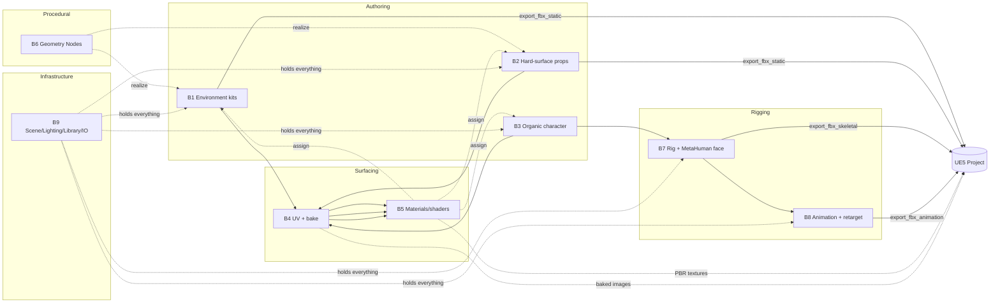

# WORKFLOWS.md

The cross-domain mental model. What a 3D artist does in Blender to make game assets for UE5, broken into the pipelines our agent must drive end-to-end.

This file is the **map**. The per-pipeline catalogs in [pipelines/](pipelines/) are the **territory**. Read this first, then dive into the relevant `B*.md`.

The export contract every pipeline must respect: [UE-TARGETS.md](UE-TARGETS.md).

---

## 1. The seven pipelines

| # | Pipeline | Catalog file | What it produces |
|---|---|---|---|
| 1 | Environment / modular kits | [pipelines/B1-environment-kits.md](pipelines/B1-environment-kits.md) | Many small reusable static meshes that snap on a grid; `UCX_*` collision; lightmap-free; ready for World Partition |
| 2 | Hard-surface props | [pipelines/B2-hard-surface-props.md](pipelines/B2-hard-surface-props.md) | Weapons, machinery, architectural details with high-to-low bake workflow + LODs + `UCX_*` collision |
| 3 | Organic / character mesh | [pipelines/B3-organic-character.md](pipelines/B3-organic-character.md) | A clean game-ready humanoid mesh in A-pose, MetaHuman-compatible head topology, shape keys for ARKit-52 |
| 4 | UV mapping + texture baking | [pipelines/B4-uv-and-baking.md](pipelines/B4-uv-and-baking.md) | PBR texture set (normal, roughness, metallic, AO, base color) baked from high to low, with optional UDIM / trim sheets |
| 5 | Materials & shader nodes | [pipelines/B5-materials-shaders.md](pipelines/B5-materials-shaders.md) | Principled BSDF graphs that round-trip cleanly through FBX/glTF → UE Material Importer |
| 6 | Geometry Nodes + Compositor | [pipelines/B6-geometry-nodes-compositor.md](pipelines/B6-geometry-nodes-compositor.md) | Procedural scatter (forests, rock fields), realized + baked to mesh for UE export; render-time post-processing |
| 7 | Rigging + MetaHuman face | [pipelines/B7-rigging-metahuman.md](pipelines/B7-rigging-metahuman.md) | UE5 SK_Mannequin-compatible armature with IK virtual bones, sockets, vertex weights; ARKit-52 blendshape set on a head mesh |
| 8 | Animation + retargeting + export | [pipelines/B8-animation-export.md](pipelines/B8-animation-export.md) | Per-clip FBX/glTF animations baked from constraints/drivers; retargeted to Mannequin; FBX 2014+ binary |
| 9 | Lighting + camera + render + scene/library/IO | [pipelines/B9-lighting-camera-render-scene.md](pipelines/B9-lighting-camera-render-scene.md) | Cinematic renders + scene organization (collections, view layers, library link/override) + `.blend` save/load |

The first eight are **asset-production pipelines**. The ninth is the **infrastructure** that holds the project together — scenes, files, library reuse, and the final render path used for documentation/preview frames.

---

## 2. The single dependency diagram

How asset data flows between pipelines and into UE5.

Three rules read directly off the diagram:

1. **Bake before assign.** B4 (bake) must complete before B5 (material assignment) can wire the image textures into the Principled BSDF.
2. **Realize before export.** B6 (Geometry Nodes) procedural results must be applied/realized into mesh data before any export tool runs — UE does not consume Blender's GN graph, only the baked mesh.
3. **Rig before animate.** B7 must produce a valid UE5-compatible armature (per [UE-TARGETS §1.1](UE-TARGETS.md)) before B8 can bake animations against it.

---

## 3. Canonical orderings per pipeline

The detailed per-step orderings live in each `B*.md` §1 (Canonical Workflow). The brief versions:

### B1 Environment / modular kits
1. Set unit scale to meters; enable grid snap.
2. Blockout primitives on the grid.
3. Author modular pieces with pivot at snap corner.
4. Assign materials + validate slot order.
5. Optional: instance via Linked Duplicates or Collection Instances.
6. UV unwrap (lightmap optional under Lumen).
7. Add `UCX_*` collision proxies.
8. Batch export FBX per piece.

### B2 Hard-surface props
1. Reference + blockout.
2. Modifier stack: Mirror → Array → Subdiv → Boolean → Bevel.
3. Edge crease / bevel weight / mark sharp.
4. Duplicate to high-poly (sculpt details).
5. Decimate to low-poly.
6. UV unwrap low-poly.
7. Bake high → low (B4).
8. Material assign (B5).
9. Triangulate, LODs, `UCX_*` collision.
10. Export.

### B3 Organic / character
1. Base mesh box-modeling from a cube/sphere.
2. (Optional) Multires + sculpt mode for detail.
3. Retopo (manual or shrinkwrap).
4. UV unwrap.
5. Shape keys (basis + targets, ARKit-52 if MetaHuman).
6. Hand off to B7 for rigging.

### B4 UV + bake
1. Mark seams in Edit Mode.
2. Unwrap (Smart UV or angle-based).
3. Pack islands.
4. Create target image + UV layer per channel.
5. Set up baking: Cycles + Selected-to-Active + cage.
6. Bake normal → roughness → metallic → AO → base color.
7. Save images (EXR for masters, PNG for distribution).

### B5 Materials / shaders
1. Create material, `use_nodes = True`.
2. Add Principled BSDF + Image Texture nodes (one per channel).
3. Wire texture coords + Mapping.
4. Set color spaces (sRGB for color, Non-Color for normal/roughness/metallic).
5. Compose into UE-compatible PBR preset.
6. Assign to object material slots in correct order.
7. (Optional) Pack into node groups for reuse.

### B6 Geometry Nodes
1. Create `GeometryNodeTree` data-block.
2. Add Geometry Nodes modifier on host object.
3. Wire procedural graph (Distribute Points on Faces → Instance on Points → Realize Instances).
4. Set typed inputs on the modifier.
5. Apply modifier (commit to mesh).
6. Export the realized mesh.

### B7 Rigging
1. Create armature.
2. Enter Edit Mode → add bones (head/tail/roll/parent).
3. For UE5 character: build full Mannequin hierarchy via `armature_create_ue5_mannequin` composite.
4. Add IK virtual bones (zero weights, required for retarget).
5. Bone collections (4.0+) for organization.
6. Vertex group + weight assignment (data-level — never freehand brush).
7. Add bone constraints (IK chains, Copy Rotation, Limit Rotation, etc.).
8. Add drivers (e.g., face control → ARKit blendshape).
9. Sockets via `SOCKET_*` empties parented to bones.
10. Apply rest pose if needed.

### B8 Animation + retarget + export
1. Create Action, set scene FPS, set frame range.
2. Insert keyframes (object or pose bone, per data path).
3. (Optional) F-curve modifiers (Cycles, Noise, Limits).
4. (Optional) Push to NLA strip for layering.
5. **Bake constraints/drivers into keyframes** before export (`nla_bake_to_action`).
6. (Optional) Retarget to Mannequin via per-bone Copy-Rotation pattern + bake.
7. Export: one FBX per Action (UE constraint).

### B9 Scene / Lighting / Camera / Render / Library / IO
A. Lighting — sun/area/point/spot lights, light groups, world HDRI.
B. Camera — lens, sensor, DOF, active camera.
C. Render — Cycles or EEVEE Next, samples, denoise, output format.
D. Scene/Collection/Library — organize, library-link external `.blend`, library override.
E. File IO — save / save-as / open / append / pack.

---

## 4. Cross-domain integration points (the seams)

Where two pipelines hand off data. Each seam corresponds to an ID-chain in the tool output `refs` contract.

### Seam: B3 → B7 (mesh → armature)
- B3 finishes with a clean mesh (UV-mapped, shape keys present).
- B7 takes `objectName` (the mesh), creates the armature, and parents mesh to armature with `vertex_group_create_from_armature` + `vertex_group_auto_weight_from_armature`.

### Seam: B7 → B8 (rig → animation)
- B7 produces `armatureName` + bone names matching [UE-TARGETS §1.1](UE-TARGETS.md).
- B8 keyframes pose bones by name — fails fast if armature is not Mannequin-compatible.

### Seam: B4 → B5 (image → material)
- B4 emits `imageName` for each baked channel (normal, roughness, …).
- B5 consumes `imageName` in `shader_node_add_image_texture` and wires to Principled BSDF.

### Seam: B6 → B1/B2 (geo-node tree → realized mesh)
- B6's `geo_node_modifier_apply` commits the procedural result into mesh data.
- The realized mesh is now a normal mesh and follows B1/B2 export rules.

### Seam: B1 ↔ B9 (kits ↔ collections/scenes)
- B1 organizes modular pieces into Collections.
- B9 `library_link` lets one `.blend` reference another's collections — the kit lives in one master `.blend`, levels link the kit.

### Seam: B7 → B9 (rig assets → asset browser)
- B7 produces a finished rig.
- B9 `asset_mark` makes it browsable, with catalog + tags + preview.

### Seam: B5 ↔ B7 (face-rig drivers ↔ shape keys)
- B7 generates ARKit-52 shape keys (`shape_key_create_arkit_set`).
- B7 also wires drivers (`shape_key_add_driver` / `driver_add_from_bone_rotation`) so face control bones drive blendshape values.
- B5 isn't strictly involved here — the data path is bone → driver → shape key.

---

## 5. End-to-end recipes (composite flows)

These are the **high-level composite recipes** every agent should be able to drive in one call. Full step-by-step playbooks live in [WORKFLOW-RECIPES.md](WORKFLOW-RECIPES.md).

| Recipe | Brief | Touches pipelines |
|---|---|---|
| `character_export_ue5_skeletal` | Take a rigged character mesh and produce a UE5-ready FBX in A-pose | B3, B7, B8 |
| `character_retarget_to_ue5_mannequin` | Take a source rig + animation and bake it onto the SK_Mannequin skeleton | B7, B8 |
| `metahuman_face_blendshapes_setup` | Add the full ARKit-52 shape-key set to a head mesh and stub drivers | B3, B7 |
| `level_modular_kit_bake_export` | Author a modular kit, UV + bake + materials, batch export every piece | B1, B4, B5 |
| `prop_high_to_low_bake_export` | Sculpt a high-poly, retopo low-poly, bake the high→low, export | B2, B3, B4, B5 |
| `procedural_foliage_scatter_export` | Build a GN scatter, apply, export the realized mesh | B6, B1 |
| `cinematic_render_sequence` | Set lighting + camera + render Cycles animation to disk | B9, B1, B2 |
| `animation_bake_export_gltf` | Bake an Action with constraints into clean keyframes, export glTF | B8 |

---

## 6. The constraints every pipeline must observe

Synthesized from all nine `B*.md` reports — these are non-negotiable.

1. **`bpy` is single-threaded.** Every mutation is marshalled through `bpy.app.timers.register(drain, persistent=True)`. HTTP handler thread never touches `bpy.*` directly. See [ARCHITECTURE §3](../ARCHITECTURE.md).
2. **Mode-aware mutation.** Bone editing requires Edit Mode on the armature; mesh editing requires Edit Mode on the mesh; sculpt requires Sculpt Mode; baking requires Cycles render engine + the target Image Texture node selected/active. Every composite tool must enter the right mode, mutate, restore mode.
3. **One `undo_push` per composite.** Multi-step composites end with a single `bpy.ops.ed.undo_push(message=...)` so the user has one undo step in the UI.
4. **Realize before export.** Geometry Nodes modifiers must be applied (or set `realize_instances = True` upstream) before any FBX export.
5. **Triangulate before export.** UE requires triangulated geometry. Apply `Triangulate` modifier or use the FBX exporter's `use_triangles=True`.
6. **Name-keyed refs.** Blender entities are keyed by `.name`. Tool outputs return `refs.objectName`, `refs.materialName`, `refs.boneName`, etc. — never `id` integers. See [ADR-005](../DECISIONS.md).
7. **Bake constraints into keyframes for animation export.** UE does not understand Blender constraints — `nla_bake_to_action` is mandatory before `export_fbx_animation` whenever the source rig uses IK/Copy-Rotation/drivers.
8. **One Action per FBX.** UE FBX importer reads one animation per file. Batch-export tools loop one-export-per-Action.
9. **Bone-collection-aware, not bone-layer.** Blender 4.0+ replaced bone layers with `armature.collections`. Tools must use the new API.
10. **Library Override has gotchas.** Resync after upstream changes; broken overrides become orphan datablocks. See [B9-lighting-camera-render-scene.md §D6-D8](pipelines/B9-lighting-camera-render-scene.md).
11. **`exec_python` is opt-in, never default.** Requires `BLENDER_AGENT_ALLOW_EXEC=1` to expose. See [B9 §E7](pipelines/B9-lighting-camera-render-scene.md) and the recommendation in [DECISIONS.md](../DECISIONS.md).

---

## 7. The modal blockers (what the agent CANNOT do)

Some Blender operators are **fundamentally interactive** — they require mouse drags + screen-space input that an agent cannot deterministically replay. These are RED in [BPY-FEASIBILITY.md](BPY-FEASIBILITY.md). The agent's role for these is **setup + verify**, never **execute**.

| Blocker | Pipeline | Workaround |
|---|---|---|
| Sculpt brush strokes (freehand) | B3 | Agent sets up Sculpt Mode + brush params (data-level); human or `sculpt_brush_stroke_deterministic` (replay a pre-recorded stroke list) drives the actual sculpting. `sculpt_remesh_voxel`, `sculpt_symmetrize`, `sculpt_mask_create_from_cavity` are non-modal and feasible. |
| Weight paint brush strokes | B7 | Agent assigns weights data-level via `vertex_group.add(indices, weight)`. Auto-weight via `bpy.ops.object.parent_set(type='ARMATURE_AUTO')` works. Freehand painting stays with the human. |
| Texture painting | B5 | Agent sets up the canvas + brush params; actual painting is human. Bake (B4) is the deterministic alternative for surface detail. |
| Knife tool / Loop Cut modal | B2 | Use the non-modal `bpy.ops.mesh.bevel(...)` and `bpy.ops.mesh.loopcut_slide(...)` with explicit numeric inputs. Or use `bmesh` directly for surgical edits. |
| Polybuild (retopo) | B3 | Use shrinkwrap modifier + manual mesh build via `bmesh`. The agent cannot click-and-place verts on a target surface interactively. |
| 3D Viewport gizmos / dragging | All | Replace with explicit transform operators (`obj.location = (...)`, `bpy.ops.transform.translate(value=...)`). |

The `bpy.context.temp_override(area=...)` pattern unlocks many operators that *look* modal but actually accept all params — they just need a 3D View context to exist. Headless mode requires synthesizing a temp window/area; see [ARCHITECTURE §4](../ARCHITECTURE.md) for the marshalling pattern.

---

## 8. Where to go next

- For the full export contract: [UE-TARGETS.md](UE-TARGETS.md).
- For the green/yellow/red feasibility verdict per step: [BPY-FEASIBILITY.md](BPY-FEASIBILITY.md).
- For entity-type relationships across pipelines: [TYPE-GRAPH.md](TYPE-GRAPH.md).
- For every proposed tool, indexed by group + name + status: [TOOL-CATALOG.md](TOOL-CATALOG.md).
- For end-to-end composite recipes: [WORKFLOW-RECIPES.md](WORKFLOW-RECIPES.md).
- For full-depth tool entries (Zod sketches, Python outlines, errorCodes, tests): the per-pipeline files under [pipelines/](pipelines/).
