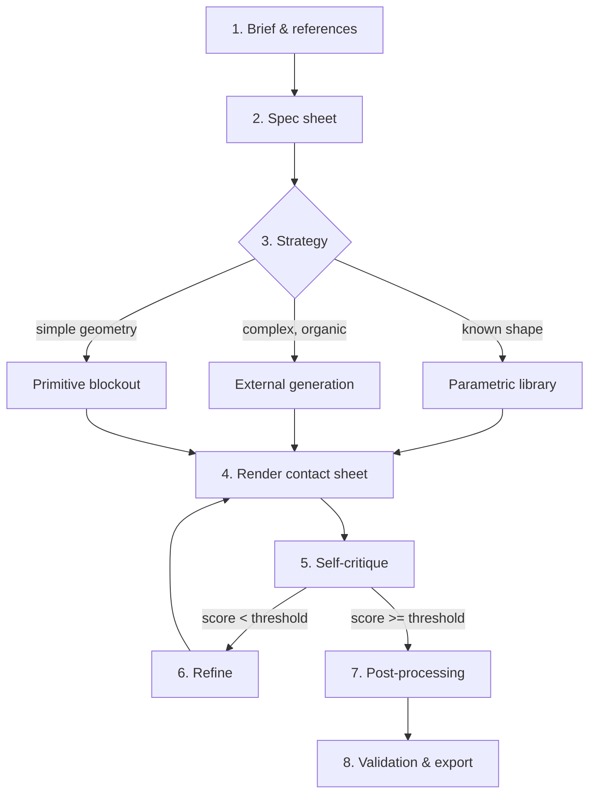

# AAA Modeling Playbook

You are about to make 3D content with the `blender-agent` MCP. The default agent reflex is *"call `/object/create` with a cube and hope."* That reflex produces blockouts, not assets. This skill rewires it.

Three rules, drilled in:

1. **No mesh before a brief.** You collect references, write a spec, lock proportions, THEN model.
2. **Recycle, don't lance.** Model → render → critique → fix → repeat. The AlphaFold playbook: iteration 1 has 90% violations, iteration 8 has zero.
3. **Parametric > generative > primitive.** Try the parametric library first. Generate (external API) second. Hand-build with primitives only when nothing else fits.

---

## The pipeline (canonical order)



---

## Phase 0 — Make sure Blender is open (do this first, always)

Before any modeling tool call, call **`blender_launch`**. It reuses an already-open Blender if one is reachable, or launches a GUI Blender from the default install path otherwise. This guarantees:

- tool calls don't fail with `BLENDER_UNREACHABLE`,
- `vision_snapshot` gets the fast viewport path (instant) instead of falling back to a render,
- the user can watch the work happen in a real window.

If you ever need to recover a wedged session, `blender_quit` then `blender_launch`. `addon_restart` reloads addon code without quitting.

---

## Phase 1 — Brief & references (always, no exceptions)

Before any tool call, write a one-paragraph brief:

> "Beach chair, Brazilian beach style, ~1.7m long, low recliner (~30° back angle), weathered teak frame, faded orange canvas, 7 wooden slats on the seat. Target: hero prop, exportable to UE5."

Then gather references. Free sources, in order:

| Source | When | How to access |
|---|---|---|
| Web search via the workspace `web` tool | Always start here | Search for "<object> reference sheet front side top", "<object> blueprint", "<object> turnaround" |
| [Polyhaven](https://polyhaven.com/) | HDRIs + sometimes models | Free, CC0 |
| [Sketchfab](https://sketchfab.com/) | Read-only inspection | Free models filterable |
| [Three.dropbox folder of pose refs] | Character anatomy | Generic searches |
| Existing assets in `bpy.data` | Continuing a session | `/object/list` + `/render/render_still` of a turntable |

You want **at minimum 3 references**: front, side, plus one stylistic/contextual reference. This mirrors AlphaFold's MSA — multiple aligned views constrain the answer.

If the user provided no references and the subject is non-trivial, ASK for at least one or use web search. Don't model blind.

---

## Phase 2 — Spec sheet

Write a structured spec into your scratchpad before the first MCP call:

```yaml
target: beach_chair
class: furniture/recliner
dimensions_m: [length: 1.70, width: 0.60, height_max: 0.95]
proportions:
  recline_angle_deg: 28
  seat_height_m: 0.40
  slat_count: 7
materials:
  frame: weathered_teak
  fabric: faded_canvas_orange
quality_target: hero_prop
polycount_budget: 8000_tris
texture_resolution: 2048
deliverables: [blend_file, fbx_export, render_turntable]
```

This spec drives every parameter call later. **Anchored numbers in the spec ⇒ deterministic agent behavior.** Drifting from the spec is a code smell.

---

## Phase 3 — Strategy decision

Before modeling, branch:

### Path A — Parametric (PREFERRED when applicable)

If the subject is in `BlenderAgent/library/` (furniture, generic vegetation, basic vehicles), use it. One call → topologically clean mesh with correct proportions.

```text
/parametric/list                    # see what's available
/parametric/build  name="chair_beach" params={length: 1.70, ...}
```

Parametric gives you: correct topology, predictable polycount, named parts (Seat, BackSlat_1..7, Leg_FL/FR/BL/BR), already-applied scale, ready-for-rigging.

### Path B — External generation (when parametric absent)

For organic / one-off / "creative" shapes (dragon, sculpted bust, alien tree). Currently delegated to external services through their addon installs:
- Hunyuan3D 2.1 (open-source, local, 16GB VRAM) — `hy3dgen` Python package + their addon.
- Tripo3D / Meshy / Rodin (commercial APIs).

This skill does NOT implement those bridges yet — but when you face a "model me a dragon" prompt, write a TODO and fall back to Path C, then surface the gap.

### Path C — Primitive blockout (last resort)

Building from `CUBE`, `CYLINDER`, etc. via `/object/create`. **Only use for:**
- Architecture / level blockouts where geometry IS boxes.
- Stylized low-poly where the look IS primitive.
- Bootstrapping a base mesh that will be sculpted/remeshed afterwards.

If you find yourself doing more than ~10 primitive calls for a single "asset", STOP. You're rebuilding the parametric library inline. Promote that asset into `BlenderAgent/library/` first.

---

## Phase 4 — Look at what you built (the AlphaFold loop step 1)

After ANY model change, **look at it before doing anything else.** Two tiers — don't confuse them:

**Inner loop (every iteration) → `vision_snapshot`.** One fast PNG. On a GUI Blender it's an instant viewport screenshot; in background it falls back to a single ~16-sample EEVEE render. Sub-second either way. This is what you call dozens of times while refining.

```text
vision_snapshot
  objectNames=["Chair_Frame", "Chair_Seat", "Chair_Back"]
  angle="three_quarter"
  outputPath="<workspace>/scripts/_out/critique/<asset>_iter_<N>.png"
```

**Final gate (once, when the silhouette is approved) → `vision_contact_sheet`.** 4 angles in a 2×2 grid, for the all-sides sign-off before post-processing/export.

```text
vision_contact_sheet
  objectNames=[...]
  angles=["front","side","back","three_quarter"]
  resolution=512        # samples default 16, engine default EEVEE — both fast
  outputPath=".../contact_<asset>.png"
```

Never run a full Cycles beauty render inside the refine loop — it blocks the single Blender main thread for tens of seconds per frame and stalls everything behind it. Keep critique renders on EEVEE + low samples (the defaults). Cycles is for the final hero shot only.

Also useful:
- `vision_turntable` — N renders rotating 360° (animation review). Heavy; use sparingly.
- `vision_topology_inspect` — quad/tri/ngon counts, manifold/non-manifold edges, normal consistency, bounding box.
- `vision_scale_report` — compares object dims against the spec.

---

## Phase 5 — Self-critique (the recycling)

You are a multimodal LLM. Look at the contact sheet. Compare against the brief and references.

Score on 6 axes (1–5 each, target ≥4 across the board):

| Axis | Failure mode |
|---|---|
| Silhouette | Doesn't read as the intended object at a glance |
| Proportions | Limbs/components wrong scale relative to each other |
| Topology | Visible n-gons, pinching, intersecting geometry |
| Material readability | Cores lavadas, no specular variation, missing roughness |
| Lighting | Flat, no contact shadows, no rim light |
| Reference match | If references provided, side-by-side dissimilar |

If any axis < 4, list the **specific** issue and the **specific** fix:

> Axis: Proportions — score 2.
> Issue: backrest 30% too short compared to ref image.
> Fix: `/parametric/update name="chair_beach" params={backrest_length_m: 0.85}`.

This structured critique IS the recycling. Without it, refinement is a guess.

---

## Phase 6 — Refine

Apply ONE class of fix per iteration. Don't change parameters AND materials AND lighting in the same iteration — you won't know which moved the score. (This is also AlphaFold discipline: each recycling step refines a specific representation, not everything at once.)

Stop when:
- All 6 axes ≥ 4, OR
- 5 iterations passed without score increase (you're in a local minimum — change strategy: try Path B, or change reference, or escalate to user).

---

## Phase 7 — Post-processing pipeline

Once silhouette is approved, run the AAA pipeline:

```text
1. /mesh/voxel_remesh       voxelSize=0.005       # uniform topology, removes intersections
2. /mesh/quad_remesh        targetQuads=4000      # QuadriFlow → quad-dominant topology
3. /mesh/shade_smooth                              # smooth normals + autosmooth
4. /uv/smart_project        angleLimit=66          # one-shot UV unwrap
5. /material/create_pbr     name="Frame"           # PBR material slot
6. /bake/bake_texture       map="DIFFUSE"          # bake albedo to 2k
7. /bake/bake_texture       map="NORMAL"           # bake normal map
8. /modifier/add            type="DECIMATE" ratio=0.5  # LOD1
9. /export/fbx              ...                    # ready for engine
```

Each step has known knobs. The spec tells you what numbers to pass.

---

## Phase 8 — Validation & export

Final gates:

| Check | Tool | Pass criterion |
|---|---|---|
| Polycount within budget | `/vision/topology_inspect` | tris ≤ spec polycount_budget |
| Single mesh per logical part | `/object/list` | counts match spec parts |
| No n-gons | `/vision/topology_inspect` | ngonCount == 0 (unless explicitly allowed) |
| UVs unwrapped | `/uv/info` (TODO: add if missing) | every selectable face has UV |
| Dimensions sane | `/vision/scale_report` | within 10% of spec |
| Final render acceptable | `/vision/contact_sheet` + self-critique | all 6 axes ≥ 4 |

Then export and commit the demo script that built it.

---

## The AlphaFold transferred principles (cheat sheet)

| AF concept | Modeling-3D equivalent | Where it lives in this MCP |
|---|---|---|
| MSA (multiple sequence alignment) | Multi-reference grounding | Phase 1 — gather ≥3 refs |
| Pair representation (residue-i × residue-j) | Anatomy/proportions matrix | `BlenderAgent/library/anatomy/proportions.py` |
| Recycling (iterate the whole model 8× before output) | Render-critique-refine loop | Phase 4–6 |
| pLDDT (per-residue confidence) | Per-part topology/scale report | `/vision/topology_inspect`, `/vision/scale_report` |
| SE(3)-equivariant transformer | Local-space tool operations | Every tool that operates on object-local axes |
| Diffusion refinement (AF3) | Post-processing pipeline | Phase 7 |

---

## Common failures and their fixes

| Symptom | Real cause | Fix |
|---|---|---|
| "It looks like blocks." | Phase 1 skipped. No references, no spec. | Stop modeling. Go gather references. Write spec. Restart. |
| "Render is washed out." | Color management compensation forgotten. | Hyper-saturate Base Color (×2.5) or switch view transform to Standard. |
| "Mesh has holes / intersects itself." | Modelled at primitive level, never unified. | `/mesh/voxel_remesh` before any other postproc. |
| "Won't import to engine." | UVs missing / non-manifold / scale not applied. | Phase 7 + Phase 8 ran in full. |
| "Took 100 calls to make a chair." | Strategy decision skipped Path A. | Add to parametric library. Future calls = 1. |
| "Agent keeps refining the same problem." | No structured critique scoring. | Force the 6-axis score; require numbers. |

---

## When to escalate to user

- Subject explicitly demands hand-sculpted detail (faces, hands, fur close-ups) — out of scope for parametric/primitive paths.
- Reference image needed but no web access + user didn't provide.
- Polycount budget impossible (e.g. "low-poly dragon at 500 tris" but spec needs scales).
- Spec internally inconsistent (length=2m, width=3m, slat_count=200 on 0.5m wide chair).

Escalate by writing a one-line message in your response, not by halting silently.

---

## Where to look next

- `BlenderAgent/library/anatomy/proportions.py` — proportion priors for humans, common animals, furniture.
- `Tools/test/tools/vision.test.ts` — examples of contact_sheet usage.
- `scripts/demo_beach_chair_v2.ps1` — end-to-end example using parametric + visual loop.
- `.claude/skills/tool-chains/SKILL.md` — composing tools into atomic flows.
